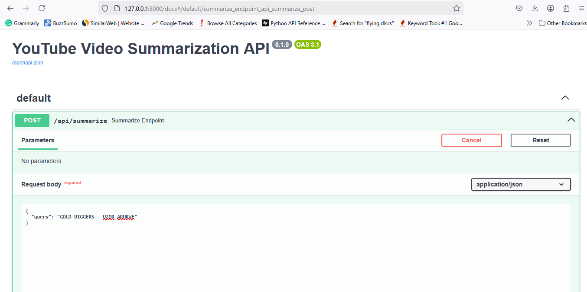
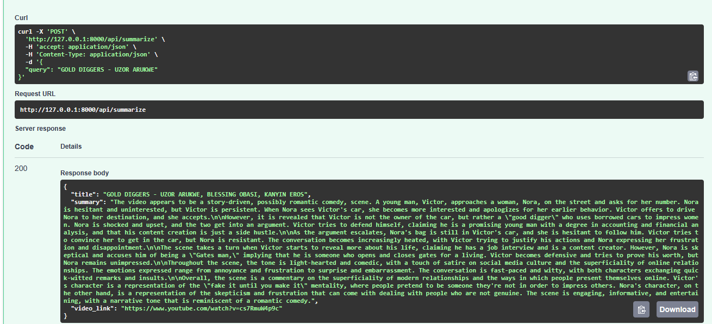
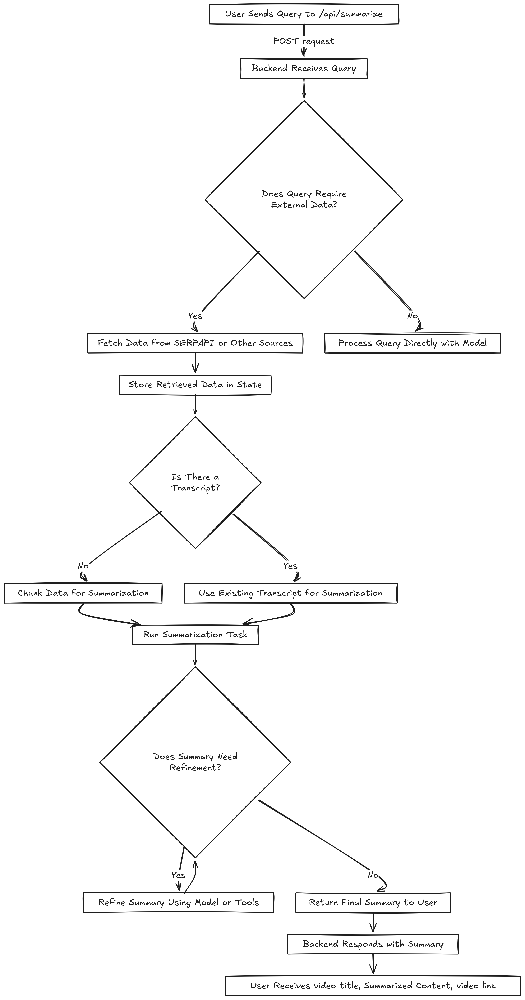
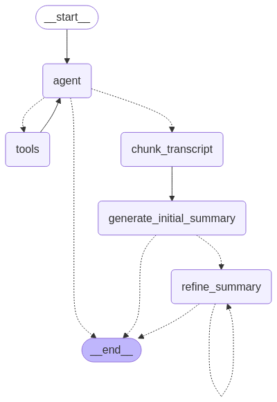

# Summarization API

## Overview

This project provides an API endpoint (`/api/summarize`) that accepts user queries and returns a summarized response. It integrates various tools and models to fetch, process, and refine content dynamically. The workflow is designed to handle both direct summarization tasks and queries requiring external data retrieval.

### Query


### Response


## Tech Stack

- **FastAPI**: For building the backend API.
- **LangChain**: To orchestrate language model interactions.
- **LangGraph**: For defining the workflow structure.
- **SERPAPI**: For fetching external search results (when required).
- **Together API**: For LLM inference.
- **PostgreSQL (optional)**: For storing retrieved data.
- **Docker (optional)**: To containerize the application.

## API Endpoints

### `POST /api/summarize`

#### Request Body

```json
{
  "query": "GOLD DIGGERS - UZOR ARUKWE"
}
```

#### Response

```json
{
  "title": "GOLD DIGGERS - UZOR ARUKWE, BLESSING OBASI, KANYIN EROS",
  "summary": "The video appears to be a story-driven, possibly romantic comedy, scene. A young man, Victor, approaches a woman, Nora, on the street and asks for her number. Nora is hesitant and uninterested, but Victor is persistent. When Nora sees Victor's car, she becomes more interested and apologizes for her earlier behavior. Victor offers to drive Nora to her destination, and she accepts.\n\nHowever, it is revealed that Victor is not the owner of the car, but rather a \"good digger\" who uses borrowed cars to impress women. Nora is shocked and upset, and the two get into an argument. Victor tries to defend himself, claiming he is a promising young man with a degree in accounting and financial analysis, and that his content creation is just a side hustle.\n\nAs the argument escalates, Nora's bag is still in Victor's car, and she is hesitant to follow him. Victor tries to convince her to get in the car, but Nora is resistant. The conversation becomes increasingly heated, with Victor trying to justify his actions and Nora expressing her frustration and disappointment.\n\nThe scene takes a turn when Victor starts to reveal more about his life, claiming he has a job interview and is a content creator. However, Nora is skeptical and accuses him of being a \"Gates man,\" implying that he is someone who opens and closes gates for a living. Victor becomes defensive and tries to prove his worth, but Nora remains unimpressed.\n\nThroughout the scene, the tone is light-hearted and comedic, with a touch of satire on social media culture and the superficiality of online relationships. The emotions expressed range from annoyance and frustration to surprise and embarrassment. The conversation is fast-paced and witty, with both characters exchanging quick-witted remarks and insults.\n\nOverall, the scene is a commentary on the superficiality of modern relationships and the ways in which people present themselves online. Victor's character is a representation of the \"fake it until you make it\" mentality, where people pretend to be someone they're not in order to impress others. Nora's character, on the other hand, is a representation of the skepticism and frustration that can come with dealing with people who are not genuine. The scene is engaging, informative, and entertaining, with a narrative tone that is reminiscent of a romantic comedy.",
  "video_link": "https://www.youtube.com/watch?v=cs7RmuW4p9c"
}
```

## Workflow

The summarization workflow follows these steps:

1. **User sends a query** via `/api/summarize`.
2. **Backend processes the request** to determine if external data is needed.
3. If needed, **SERPAPI fetches external data**, which is then stored.
4. The **retrieved or existing data is chunked and processed**.
5. **LangGraph manages the workflow execution**.
6. **The model generates a summary**, which may go through refinement if required.
7. The final **summary is returned to the user**.

### Workflow Diagram



### LangGraph Execution Flow



## Environment Variables

To run this project locally, create a `.env` file with the following variables:

```
SERPAPI_API_KEY=
TOGETHER_API_KEY=
LANGSMITH_TRACING=
LANGSMITH_ENDPOINT=
LANGSMITH_API_KEY=
LANGSMITH_PROJECT=
```

## Installation & Setup

### Prerequisites

- Python 3.12+
- FastAPI
- PostgreSQL (optional, if using persistent storage)
- Docker (optional, for containerization)

### Steps

1. Clone the repository:
   ```sh
   git clone https://github.com/uche-madu/gamma-youtube.git
   cd gamma-youtube
   ```
2. Create and activate a virtual environment:
   ```sh
   python -m venv venv
   source venv/bin/activate  # On Windows, use `venv\Scripts\activate`
   ```
3. Install dependencies:
   ```sh
   pip install -r requirements.txt
   ```
4. Set up environment variables:
   ```sh
   cp .env.example .env
   # Edit .env with your API keys
   ```
5. Run the application:
   ```sh
   uvicorn app.main:app --port 8000 --reload
   ```
6. Test the API:
   ```sh
   curl -X 'POST' \
    'http://127.0.0.1:8000/api/summarize' \
    -H 'accept: application/json' \
    -H 'Content-Type: application/json' \
    -d '{
    "query": "GOLD DIGGERS - UZOR ARUKWE"
    }'
   ```

## Future Enhancements
- Add authentication & rate limiting.
- Add memory and storage
- Introduce caching for repeated queries.
- Expand model support for different summarization techniques.

## License

This project is open-source under the MIT License.

